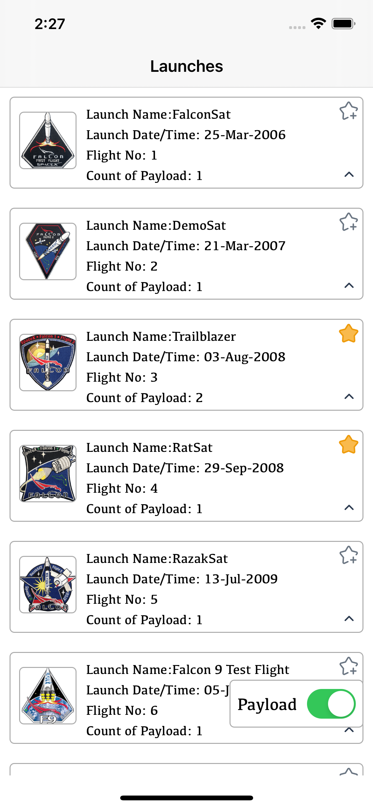
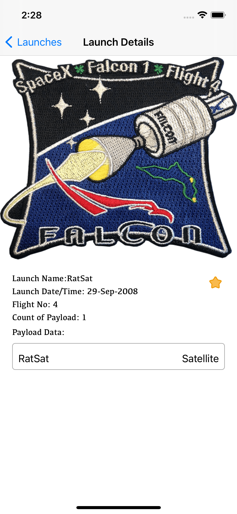
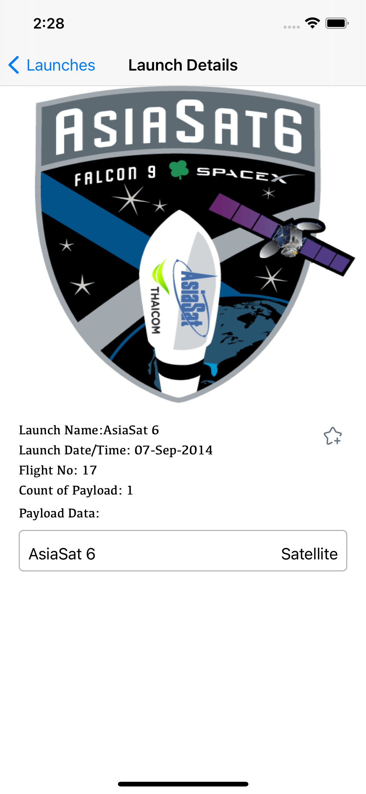
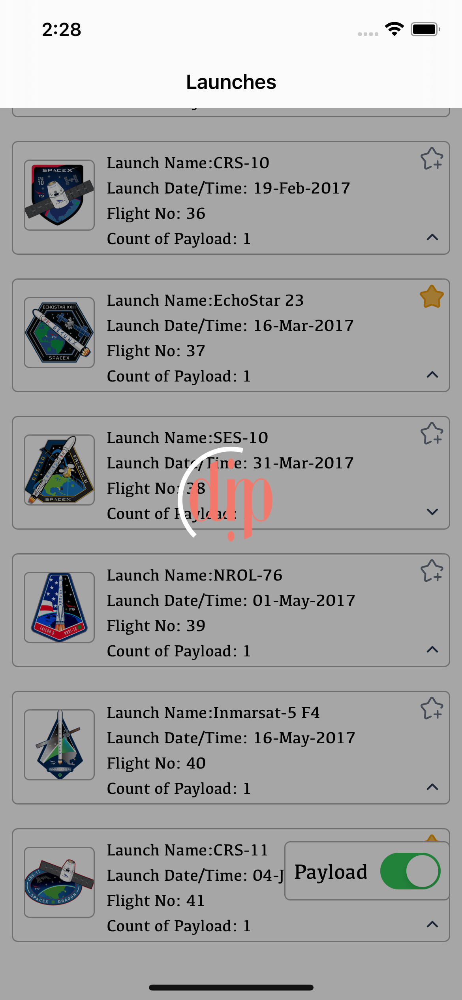
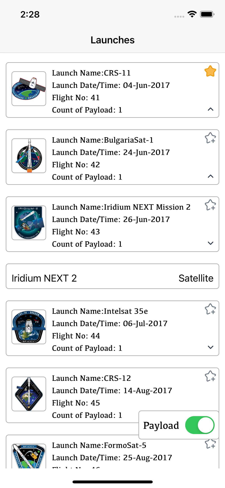

# DIP Code Challenge Test

# Project Setup 
- After downloading the project kindly use `pod install` to add RealmSwift dependency.
 
# About Project 

## 1. First screen - Listing All Launches & Payload : 
- Shows the List of all Launches from provided API.
- On selecting the drop down button it loads the payload data and stores it in memory to avoid duplicate API calls. 
- Marking a launch favorite will persist data locally between multiple app launches (Testcase has been written to validate this)
- There a payload filter UI at the bottom right corner of the screen to filter launches with payload.  (Testcase has been written to validate this)
- All the payload images are cached locally to avoid duplicate downloads and to avoid lags when scrolling (helps in better user experience in table scrolling)
- A custom loader with DIP icon is also included as and where necessary. 
- When API fails a retry mechanism allows user to get fresh data from server. 

## 2. Second screen - Add/Select Currency: 
- Second screen shows launch detail of a selected launch and loads its large size image from server. 
- Payload data for specific launch is also included at the bottom of the screen. 

# Architectural Information:
This project uses `MVVM` architecture.

# Requirements:
* iOS 14.2+
* Xcode 12.2 +
* Swift 5.3.1

# ScreenShots:

